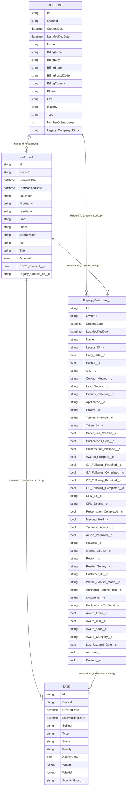

```mermaid
erDiagram
    ACCOUNT ||--o{ CONTACT : "Has (Std Relationship)"
    ACCOUNT ||--o{ Enquiry_Database__c : "Related To (Custom Lookup)"
    CONTACT ||--o{ Enquiry_Database__c : "Related To (Custom Lookup)"
    CONTACT ||--o{ TASK : "Related To (Std WhoId Lookup)"
    Enquiry_Database__c ||--o{ TASK : "Related To (Std WhatId Lookup)"

    ACCOUNT {
        string Id
        string OwnerId
        datetime CreatedDate
        datetime LastModifiedDate
        string Name
        string BillingStreet
        string BillingCity
        string BillingState
        string BillingPostalCode
        string BillingCountry
        string Phone
        string Fax
        string Industry
        string Type
        int NumberOfEmployees
        string Legacy_Company_ID__c
    }

    CONTACT {
        string Id
        string OwnerId
        datetime CreatedDate
        datetime LastModifiedDate
        string Salutation
        string FirstName
        string LastName
        string Email
        string Phone
        string MobilePhone
        string Fax
        string Title
        lookup AccountId
        bool GDPR_Consent__c
        string Legacy_Contact_ID__c
    }

    Enquiry_Database__c {
        string Id
        string OwnerId
        datetime CreatedDate
        datetime LastModifiedDate
        string Name
        string Legacy_ID__c
        date Entry_Date__c
        bool Printed__c
        string QID__c
        string Contact_Method__c
        string Lead_Source__c
        string Enquiry_Category__c
        string Application__c
        string Project__c
        string Tonnes_Involved__c
        string Taken_By__c
        bool Paper_File_Created__c
        bool Publications_Sent__c
        bool Presentation_Prospect__c
        bool Awards_Prospect__c
        bool GA_Followup_Required__c
        bool GA_Followup_Completed__c
        bool GP_Followup_Required__c
        bool GP_Followup_Completed__c
        string CPD_ID__c
        string CPD_Details__c
        bool Presentation_Completed__c
        bool Meeting_Held__c
        bool Technical_Advice__c
        bool Action_Required__c
        string Projects__c
        string Mailing_List_ID__c
        string Region__c
        string Reader_Survey__c
        string Customer_ID__c
        string Where_Contact_Made__c
        string Additional_Contact_Info__c
        string System_ID__c
        string Publications_To_Send__c
        bool Award_Entry__c
        bool Award_Win__c
        string Award_Year__c
        string Award_Category__c
        date Last_Updated_Date__c
        lookup Account__c
        lookup Contact__c
    }

    TASK {
        string Id
        string OwnerId
        datetime CreatedDate
        datetime LastModifiedDate
        string Subject
        string Type
        string Status
        string Priority
        date ActivityDate
        lookup WhoId
        lookup WhatId
        string Activity_Group__c
    }
```
