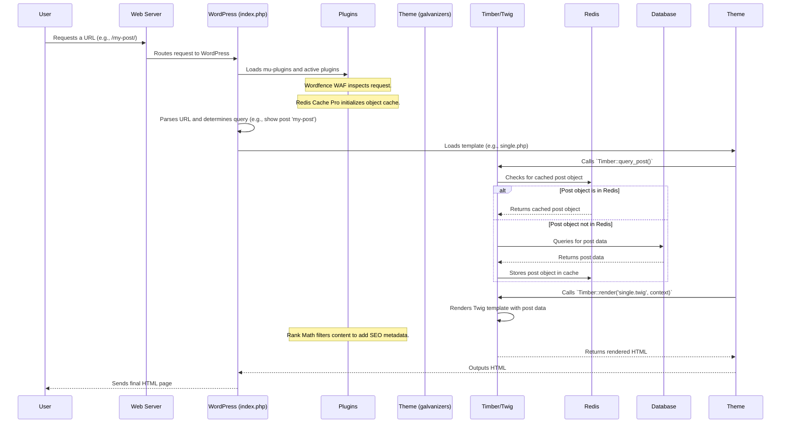
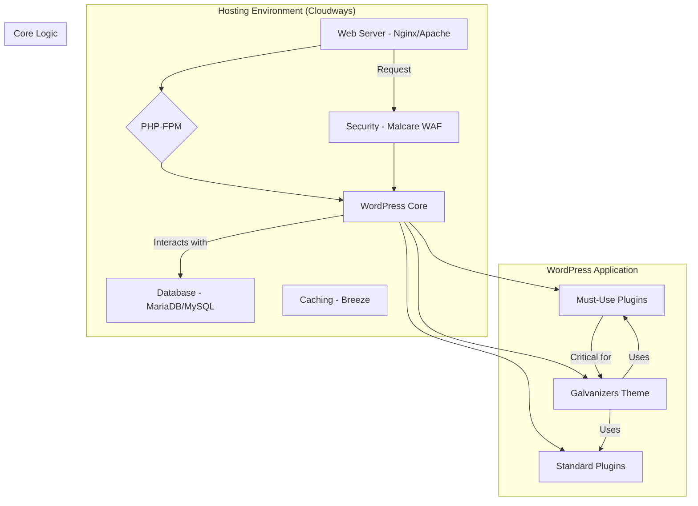
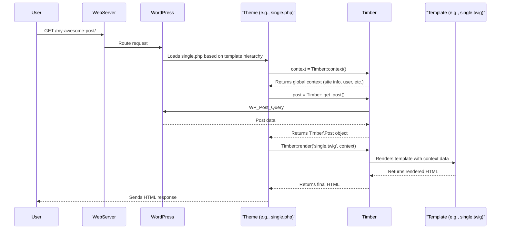

**Scope of this Document:** This document describes the architecture based on an analysis of key source files. The directory structures presented herein focus on these analyzed components and their hierarchical context. For a broader overview of all project files and directories, please consult the main repository or the Project Structure section in the README.md.

# Architecture Overview

This WordPress application is a feature-rich, plugin-based monolith, which is the standard architectural style for WordPress. It has been enhanced with modern development practices and tools to support scalability, maintainability, and security. The system is inferred to be a **WordPress Multisite** installation, designed to manage and syndicate content across a network of sites.

## Architectural Style & Principles

*   **Monolithic Application:** The system operates as a single, deployable WordPress application.
*   **Event-Driven (Hook-Based):** Core to WordPress, the architecture relies heavily on a system of "hooks" (actions and filters). Plugins and themes register functions to these hooks to modify or extend the core functionality without altering the core code itself. This promotes modularity and decoupling.
*   **Model-View-Presenter (MVP) in the Theme Layer:** The custom theme `galvanizers` uses the **Timber** library. This introduces an MVP-like pattern where:
    *   **Model:** WordPress objects (Posts, Users, etc.) and custom data fetched via PHP.
    *   **View:** Twig templates (`.twig` files) handle all HTML generation and presentation logic, keeping PHP files clean.
    *   **Presenter:** The theme's PHP files (`single.php`, `author.php`, etc.) act as presenters, fetching data (the model) and passing it to the appropriate Twig template (the view).
*   **Component-Based via Plugins:** Functionality is encapsulated within discrete plugins, each handling a specific concern (e.g., security, SEO, caching).

## Technology Choices

*   **Platform:** WordPress Multisite.
*   **Backend Language:** PHP. The plugins demonstrate modern PHP practices, including namespaces, classes, interfaces, and traits (PSR-4 autoloading is common).
*   **Frontend:** JavaScript (primarily jQuery, as is standard), with build processes (`npm`, `parcel-bundler`) used in some plugins for asset management.
*   **Templating Engine:** **Twig** (via the Timber library) is used in the theme layer, separating markup from application logic.
*   **Database:** A relational database, implicitly MySQL or MariaDB.
*   **Caching:** A multi-layered caching strategy is employed:
    *   **Object Cache:** **Redis** is used as a persistent, high-performance object cache, managed by the `redis-cache-pro` plugin. This offloads database queries for frequently accessed objects.
    *   **Page Cache:** The `Breeze` plugin likely handles full-page caching to serve static HTML to visitors, reducing server load.

## Key Components and Structure

The application's functionality is primarily delivered through a combination of the WordPress core, a custom theme, and a suite of powerful plugins. The file structure suggests a modern setup where `wp-content` is likely managed as the `app` directory.

```
.
├── app/
│   ├── mu-plugins/      # Must-Use Plugins (Core Functionality)
│   │   ├── acf-pro/
│   │   ├── jetpack/
│   │   ├── redis-cache-pro/
│   │   ├── timber-library/
│   │   └── ...
│   ├── plugins/         # Standard Plugins (Modular Features)
│   │   ├── seo-by-rank-math/
│   │   ├── threewp-broadcast/
│   │   ├── wordfence/
│   │   └── ...
│   └── themes/          # Presentation Layer
│       ├── galvanizers/     # (Active Theme) Implements MVP with Timber
│       └── ...
└── index.php            # Main WordPress Entry Point
```

### Core Components

#### 1. WordPress Core (Inferred)
*   **Responsibilities:** Provides the fundamental CMS functionality, user management, database abstraction, and the hook-based plugin API. Manages the Multisite network.

#### 2. Presentation Layer (Theme: `galvanizers`)
*   **Location:** `app/themes/galvanizers/`
*   **Responsibilities:** Controls the entire visual output of the site.
*   **Architecture:** Uses the **Timber** library to implement an MVP pattern.
    *   `functions.php`: Initializes the theme, registers custom post types, taxonomies, and ACF Options Pages (as seen in `src/AcfOptionsPages/Registerer.php`).
    *   Template Files (`single.php`, `page.php`, etc.): Act as controllers/presenters. They retrieve context from WordPress using Timber's static methods (`Timber::get_context()`, `Timber::query_post()`) and then render a corresponding Twig template.
    *   `views/` (Inferred): A directory containing Twig templates (`.twig`) that define the HTML structure.

#### 3. Content Syndication (`threewp-broadcast` Plugin)
*   **Location:** `app/plugins/threewp-broadcast/`
*   **Responsibilities:** Manages the duplication (broadcasting) of posts and their associated metadata (custom fields, taxonomies) from a source site to multiple destination sites within the Multisite network.
*   **Key Abstractions:**
    *   **Actions:** Uses the WordPress hook system extensively to allow for fine-grained control over the broadcasting process (e.g., `prepare_broadcasting_data`, `broadcasting_modify_post`).
    *   **Object Stores:** Implements a flexible persistence layer using PHP traits (`Blog_Option`, `Site_Option`, `Blog_Transient`, `Site_Transient`) to store its data either as standard options or transients, at either the site or network level.

#### 4. SEO & Structured Data (`seo-by-rank-math` & `schema-and-structured-data-for-wp` Plugins)
*   **Location:** `app/plugins/seo-by-rank-math/`, `app/plugins/schema-and-structured-data-for-wp/`
*   **Responsibilities:** Manages all aspects of Search Engine Optimization. This includes title/meta tag generation, sitemap creation, and crucially, the generation of `application/ld+json` structured data (Schema).
*   **Interaction:**
    *   Provides shortcodes (`[rank_math_rich_snippet]`) to display schema-formatted data within content.
    *   The `SASWP_Output_Rest_Api_Service` class exposes an API endpoint to retrieve schema data for a given post, likely for consumption by other services or headless frontends.

#### 5. Security (`wordfence` Plugin)
*   **Location:** `app/plugins/wordfence/`
*   **Responsibilities:** Provides a Web Application Firewall (WAF), malware scanner, and login security features.
*   **Architecture:** Operates at a low level, inspecting incoming requests before they hit WordPress core (for the WAF) and scanning the filesystem for threats. It uses its own logging and configuration systems.

#### 6. Performance & Caching (`redis-cache-pro` & `breeze` Plugins)
*   **Location:** `app/mu-plugins/redis-cache-pro/`, `app/plugins/breeze/`
*   **Responsibilities:**
    *   `redis-cache-pro`: Implements a high-performance, persistent object cache backend using Redis. This replaces the default WordPress transient/caching mechanism, reducing database load significantly.
    *   `breeze`: Likely handles page caching, GZIP compression, and asset minification to speed up frontend delivery.
*   **Note:** The `breeze-amp-compatibility.php` file shows it has logic to disable its optimizations on AMP pages to prevent conflicts.

## Data Management and Flow

### Data Persistence
*   **Primary Data:** Stored in a MySQL/MariaDB database, managed by WordPress. This includes posts, pages, users, taxonomies, etc.
*   **Plugin Data:** Stored as custom post types, custom tables, or in the `wp_options` table.
*   **Broadcast Data:** `threewp-broadcast` stores metadata about linked posts in the `wp_postmeta` table to track relationships between parent and child posts across the network.

### Data Flow (Typical Request)

A typical request for a single post illustrates the data flow and component interaction:



## Architectural Concerns and Quality Attributes

*   **Scalability:** The architecture is built for scale. The use of a persistent Redis object cache is a key decision that allows the application to handle high traffic by minimizing database interaction. The multisite architecture itself is a scaling strategy for managing numerous websites efficiently.
*   **Maintainability:** This is a mixed bag.
    *   **Positives:** The use of modern PHP, Composer, npm, and automated dependency updates (`renovate.json`) are excellent for maintainability. The Timber theme separates concerns well.
    *   **Risks:** The high number of plugins (20+) creates a complex dependency web. Updates to one plugin or WordPress core could potentially break another, requiring significant regression testing. This is a common challenge in complex WordPress sites.
*   **Security:** Security is a clear priority, with multiple dedicated plugins (`Wordfence`, `Malcare`). The code demonstrates use of WordPress security best practices (escaping, nonces). The `temporary-login-without-password` plugin is a potential risk vector that must be carefully managed.
*   **Testability:** There is strong evidence of a testing culture. Unit tests are present for several key plugins and the theme, which is a sign of a mature and professional development process.

## Analysis Methodology and Limitations

*   This analysis is based on a static review of 220 files from the project's codebase. It does not include the full source of WordPress core or every plugin.
*   The active theme and specific plugin configurations are inferred and not confirmed.
*   The documentation highlights architectural patterns and decisions evident from the provided code. A complete picture would require runtime analysis and access to the application's administrative backend.

<!-- From documentation phase -->
# Architecture Documentation

**Scope of this Document:** This document describes the architecture based on an analysis of key source files. The directory structures presented herein focus on these analyzed components and their hierarchical context. For a broader overview of all project files and directories, please consult the main repository or the Project Structure section in the README.md.

## 1. Architectural Overview

This project is a **WordPress Multisite** application built with a modern, modular architecture that significantly enhances the standard WordPress development model. The design philosophy centers on separating concerns, improving maintainability, and leveraging a robust set of tools for performance, security, and SEO.

The two most significant architectural decisions are:
1.  **MVC-like Pattern via Timber/Twig:** The system avoids the traditional WordPress "loop" in template files. Instead, it uses the **Timber library** to implement a pattern where PHP files act as controllers to fetch and prepare data, which is then passed to **Twig templates** for rendering. This separation of logic (PHP) from presentation (HTML) is the cornerstone of the theme's architecture.
2.  **Bedrock-Inspired File Structure:** The project organizes files into a structure similar to the [Roots Bedrock](https://roots.io/bedrock/) boilerplate. This moves the WordPress core into its own directory (`web/wp/`) and keeps application code (themes, plugins) in a separate `app/` directory, creating a cleaner, more secure, and more manageable codebase.

The system is hosted on **Cloudways**, and certain components, like the caching and security layers, are tightly integrated with that environment.

### Technology Choices & Rationale

*   **WordPress Multisite:** Chosen to manage multiple related websites (e.g., main site, magazine, newsroom) from a single codebase and user database, which is efficient for administration and content sharing. The `threewp-broadcast` plugin is key to this strategy.
*   **Timber/Twig:** Selected to enforce a clean separation of concerns, making the theme code easier to read, maintain, and test. It allows frontend developers to work on Twig templates with minimal PHP knowledge.
*   **PHP Namespaces & OOP:** The custom theme (`galvanizers`) and its components (`code/Galvanizers`) are written using modern PHP standards. This improves code organization, prevents naming conflicts, and promotes reusable components.
*   **Extensive Plugin Ecosystem:** The architecture relies on best-in-class plugins for non-core functionality, such as `Rank Math` for SEO, `Wordfence` and `Malcare` for security, and `Breeze` for caching. This follows the WordPress philosophy of extending a core platform with specialized tools.

## 2. Key Components and Structure

The application is composed of the WordPress core, a primary custom theme, and a suite of Must-Use and standard plugins.



### Directory Structure of Key Components

The following structure highlights the locations of the most architecturally significant components.

```
.
├── app/
│   ├── mu-plugins/
│   │   ├── google-analytics-for-wordpress/  # Analytics (as MU-Plugin)
│   │   ├── jetpack/                         # Feature suite (as MU-Plugin)
│   │   ├── redirection/                     # Redirection management (as MU-Plugin)
│   │   └── timber-library/                  # CRITICAL: Timber templating engine
│   ├── plugins/
│   │   ├── seo-by-rank-math/                # SEO Suite
│   │   ├── threewp-broadcast/               # Multisite content broadcasting
│   │   ├── wordfence/                       # Security Plugin
│   │   └── ... (other plugins)
│   └── themes/
│       └── galvanizers/                     # PRIMARY CUSTOM THEME
│           └── src/
│               ├── Helpers/
│               │   └── Pluraliser.php
│               ├── PostTypes/
│               │   └── Registerer.php       # Handles Custom Post Type registration
│               └── Taxonomies/
│                   └── Registerer.php       # Handles Custom Taxonomy registration
├── code/
│   └── Galvanizers/
│       ├── AcfOptionsPages/
│       │   └── ThemeOptions.php             # Defines ACF Options Page
│       └── Menus/                           # Defines custom navigation menus
│           ├── Footer.php
│           ├── Header.php
│           └── ... (other menus)
└── wp-content/
    └── plugins/
        ├── breeze/                          # Caching plugin (from Cloudways)
        └── malcare-security/                # Security plugin
```

### Component Details

#### 1. Galvanizers Theme (`app/themes/galvanizers/`)

*   **Responsibility:** This is the heart of the application, controlling the site's appearance, unique features, and content presentation.
*   **Structure:**
    *   Uses PHP files (`single.php`, `page.php`, etc.) as controllers.
    *   Contains a `src/` directory with namespaced, object-oriented PHP code for helpers and registering post types/taxonomies.
    *   Relies on a `views/` directory (inferred) containing `.twig` files for all HTML rendering.
*   **Interactions:** It is the primary consumer of the Timber library. It fetches data using standard WordPress functions and passes it to Twig templates. It also defines integration points for plugins like ACF.

#### 2. Timber Library (`app/mu-plugins/timber-library/`)

*   **Responsibility:** Acts as a bridge between WordPress and the Twig templating engine. It provides WordPress-aware objects and functions to the Twig context.
*   **Placement:** It is a Must-Use (MU) plugin, meaning it's always active and cannot be disabled from the admin panel. This is appropriate as the `galvanizers` theme is completely dependent on it.

#### 3. Multisite Broadcaster (`app/plugins/threewp-broadcast/`)

*   **Responsibility:** Manages the broadcasting (copying/syncing) of posts and pages between different sites in the WordPress Multisite network. This is a core component for the platform's content strategy.

#### 4. Custom Code (`code/Galvanizers/`)

*   **Responsibility:** This directory contains decoupled functionality that supports the theme. It defines custom navigation menu locations and an ACF Theme Options page. This separation suggests it might be intended to function as a core functionality plugin.

## 3. Data Management and Flow

### Data Storage

*   Data is primarily stored in a standard WordPress MySQL/MariaDB database.
*   Plugins create their own custom tables or store data in WordPress's options and meta tables. Key data contributors include:
    *   **Rank Math:** SEO metadata.
    *   **Wordfence:** Security logs and configuration.
    *   **ThreeWP Broadcast:** Linkage information between posts on different sites.
    *   **Advanced Custom Fields (ACF):** Custom field data for posts, pages, and options pages.

### Typical Request/Data Flow (Timber MVC Pattern)

This sequence diagram illustrates how a request for a single post is handled.



## 4. Deployment and Infrastructure (Inferred)

*   **Hosting:** The application is deployed on **Cloudways**, a managed cloud hosting platform. This is confirmed by hardcoded paths in `malcare-waf.php`.
*   **Deployment Process:** A formal deployment process is not evident, but it likely involves a Git-based workflow. The use of a Bedrock-like structure suggests that `composer install` would be a key step on the server.
*   **Caching:** Page and object caching is handled by the **Breeze** plugin, which is the standard caching solution provided by Cloudways.
*   **Security:** A multi-layered security approach is in place:
    *   **Wordfence:** Plugin-level firewall, malware scanner, and login security.
    *   **Malcare:** Plugin and WAF (Web Application Firewall) for proactive threat blocking. The WAF is loaded via `auto_prepend_file` in `php.ini`.

## 5. Architectural Concerns and Quality Attributes

*   **Maintainability:**
    *   **High:** The use of Timber/Twig and OOP in the custom theme makes the core application highly maintainable.
    *   **Low:** The confusing file structure with duplicated plugins (`seo-by-rank-math`) and the mix of `app/plugins` and `wp-content/plugins` creates "dependency hell" and makes plugin management difficult and error-prone. This should be a priority for cleanup.

*   **Portability:**
    *   **Low:** The application has hardcoded paths in `malcare-waf.php`, tying it directly to its current Cloudways hosting environment. Migrating to a new server would require code changes.

*   **Security:**
    *   **Good:** The use of multiple, reputable security plugins (Wordfence, Malcare) provides robust protection.
    *   **Concern:** The `temporary-login-without-password` plugin, while useful for development, can be a security risk if active or misconfigured in a production environment. Access should be strictly controlled.

*   **Testability:**
    *   **Poor:** There is no evidence of an automated testing framework (like PHPUnit) for the custom `galvanizers` theme. This means testing is likely manual, which is slow and less reliable. Implementing a test suite would significantly improve code quality and reduce regressions.

## 6. Analysis Methodology and Limitations

*   This analysis is based on the static content of 134 files.
*   **Missing Files:** Critical configuration files such as a root `composer.json`, `.env`, and any build tool configurations (`package.json`, etc.) were not available. Their absence required making educated assumptions about dependency management, environment setup, and the frontend build process.
*   **Inferred Logic:** The exact implementation of Twig templates and the internal logic of some compiled JavaScript files could only be inferred from their context and surrounding code.
